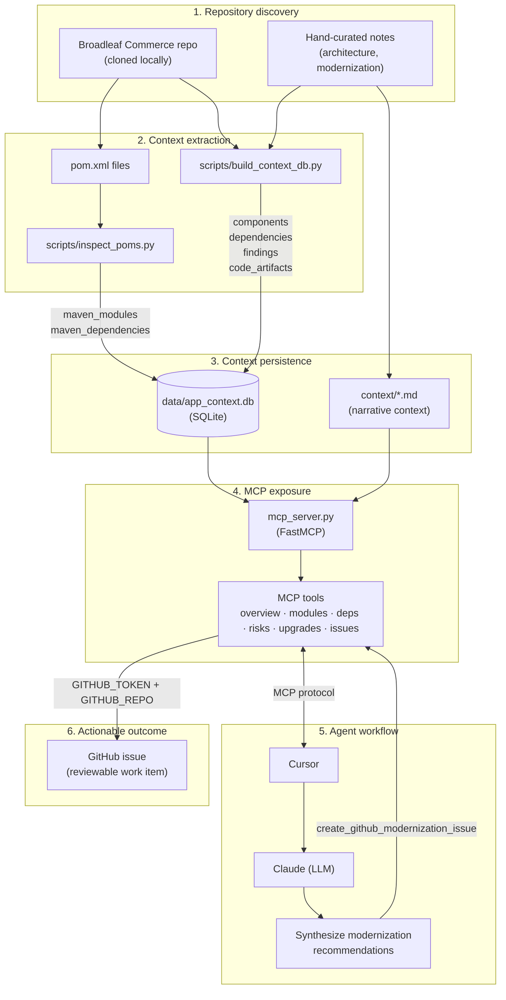

# Broadleaf Modernization MCP Demo

This project demonstrates how MCP can provide application-specific context to AI development tools.

## Components

- SQLite application context database
- Markdown architecture summaries
- MCP server exposing modernization tools
- Broadleaf Commerce modernization use case

## Design Philosophy

This project intentionally separates discovered application metadata from curated architectural knowledge. Automated discovery provides repeatable structural information (modules, Maven dependencies, packaging), while curated context captures architectural understanding and modernization guidance that cannot easily be inferred from source code alone. Together, these data sources provide richer context for AI agents through MCP.

## Data Flow: Discovery to MCP Integration

### 1. Repository discovery

Broadleaf source is cloned locally. Scripts inspect the repository structure, discover Maven modules, and extract dependency metadata from each `pom.xml`. Hand-curated architecture and modernization notes supplement the automated discovery process.

### 2. Context extraction

| Script | Role |
|--------|------|
| `scripts/inspect_poms.py` | Parses every `pom.xml` in the repo (excluding this MCP project). Extracts modules, artifact IDs, packaging, and dependency group/artifact/version/scope. |
| `scripts/build_context_db.py` | Populates curated components, logical dependencies, modernization findings, and code artifact metadata into the database. |

### 3. Context persistence

Extracted and curated data is stored in local SQLite: `data/app_context.db`.

| Table | Source | Contents |
|-------|--------|----------|
| `components` | `build_context_db.py` | Application modules and module groups |
| `dependencies` | `build_context_db.py` | Logical module relationships |
| `modernization_findings` | `build_context_db.py` | Risks and recommendations |
| `code_artifacts` | `build_context_db.py` | Curated code artifact metadata |
| `maven_modules` | `inspect_poms.py` | Parsed Maven module metadata |
| `maven_dependencies` | `inspect_poms.py` | Parsed Maven dependency graph |

Markdown files in `context/` provide higher-level narrative context:

- `architecture.md` — architecture overview
- `modernization-summary.md` — modernization summary
- `demo-script.md` — demo script / workflow notes

### 4. MCP exposure

`mcp_server.py` exposes the database and markdown context through MCP tools:

| Tool | Data source |
|------|-------------|
| `get_application_overview` | `context/architecture.md` |
| `get_components` | `components` table |
| `get_component_dependencies` | `dependencies` table |
| `get_modernization_risks` | `modernization_findings` table |
| `search_modernization_context` | `modernization_findings` table |
| `get_modernization_plan` | Built-in recommendation text |
| `analyze_module` | `components` + `dependencies` tables |
| `get_modernization_candidates` | Curated candidate list |
| `get_maven_modules` | `maven_modules` table |
| `search_maven_dependencies` | `maven_dependencies` table |
| `get_module_dependencies` | `maven_dependencies` table |
| `get_upgrade_candidates` | Curated upgrade targets |
| `create_github_modernization_issue` | GitHub API |

### 5. Agent workflow

An AI coding agent (Cursor using Claude) invokes MCP tools during analysis. The agent uses application-specific context instead of relying only on source code, synthesizes findings into modernization recommendations, and can convert the final recommendation into a GitHub issue.

### 6. Actionable outcome

The `create_github_modernization_issue` tool creates a GitHub issue using `GITHUB_TOKEN` and `GITHUB_REPO` environment variables. The issue becomes a reviewable modernization work item.

### Data flow diagram



### Pipeline order

Run the extraction scripts before starting the MCP server:

```bash
python scripts/build_context_db.py   # populate curated context (resets core tables)
python scripts/inspect_poms.py       # scan pom.xml and populate Maven tables
python mcp_server.py                 # expose context via MCP
```

Re-run `inspect_poms.py` whenever the repository changes (optional, but recommended to keep Maven metadata current).

## Requirements

- **SQLite** — required for `data/app_context.db`. Python's built-in `sqlite3` module is used by the scripts and MCP server; a system `sqlite3` CLI is optional but useful for inspection.
- **Python 3** — see `requirements.txt` for package dependencies.
- **requests** — used for GitHub issue creation.

## Tested environment

This demo was built and tested on:

| Component | Version |
|-----------|---------|
| OS | Ubuntu 24.04.4 LTS |
| Cursor | 3.8.23 |
| SQLite | 3.45.1 |
| Python | 3.12.3 |

Other platforms may work but were not validated for this demo.

## Setup

```bash
python3 -m venv .venv
source .venv/bin/activate
pip install -r requirements.txt
```

## Run

```bash
python mcp_server.py
```
