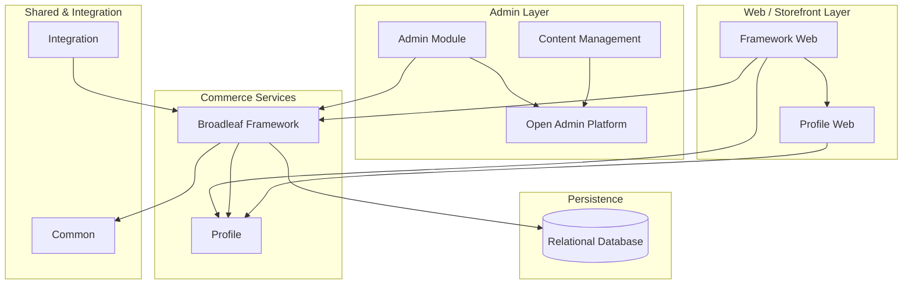
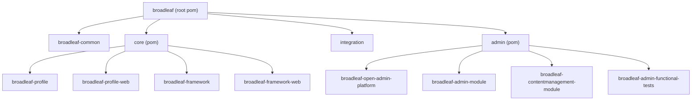
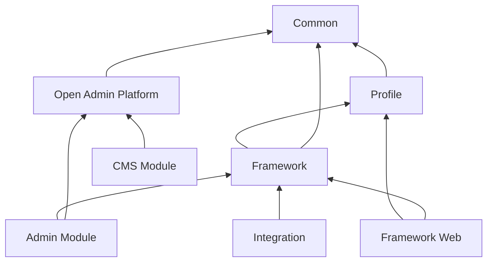
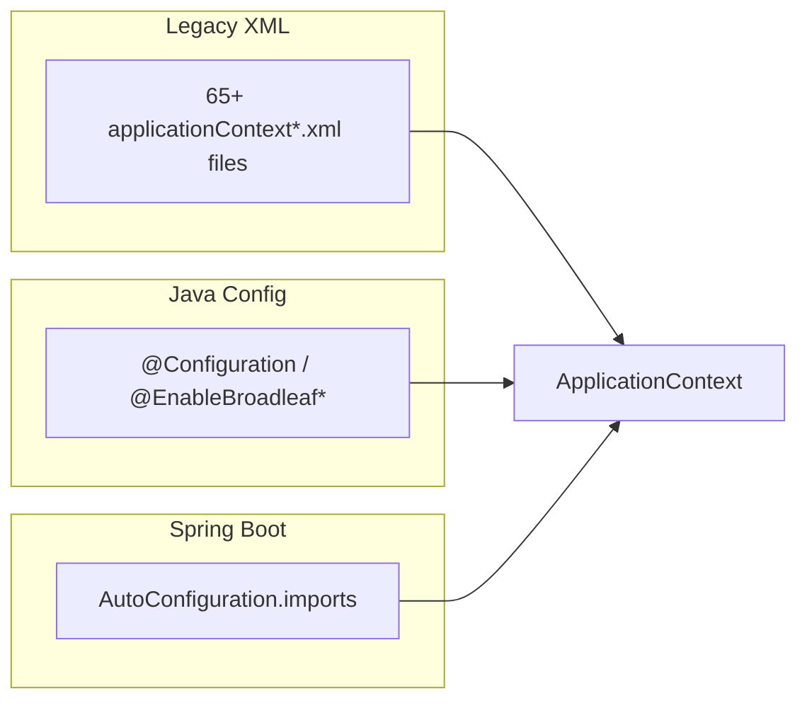
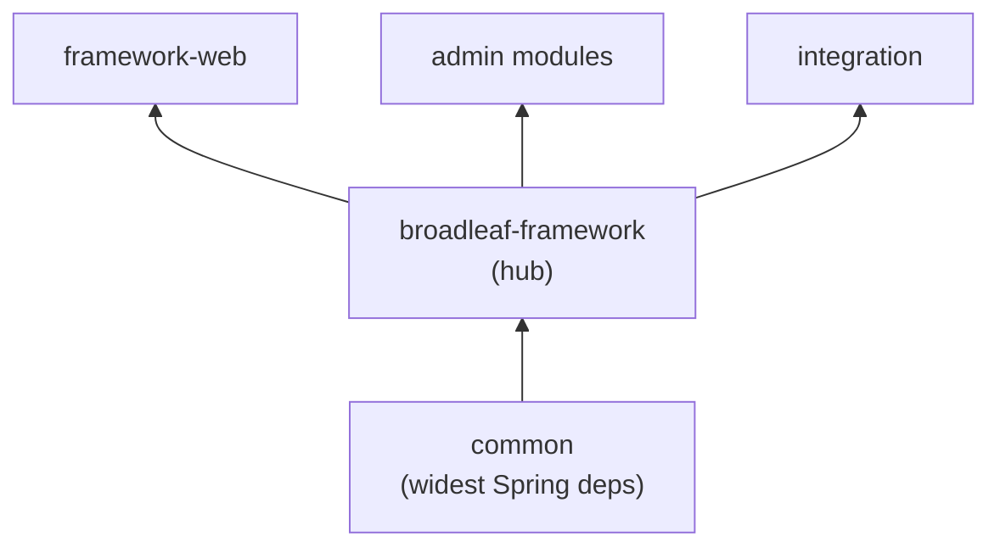

# Application architecture overview
_Exported on 6/24/2026 at 18:04:20 UTC from Cursor (3.8.11)_

---

**User**

Using the MCP tools, provide a high-level overview of the application architecture, major modules, and modernization considerations.

---

**Cursor**

I'll explore the Broadleaf modernization MCP tools and pull architecture context from them.


Next I'll query the MCP tools for the architecture overview, modules, and modernization context.


I'll pull upgrade candidates and search the modernization context for more detail.


# Broadleaf Commerce — Architecture & Modernization Overview

Based on the **Broadleaf Modernization MCP** context tools, here is a high-level picture of the application, its modules, and what to watch for when modernizing.

---

## Application Architecture

Broadleaf Commerce is a **large, enterprise Java ecommerce platform** (currently at **7.0.7-SNAPSHOT**) built as a **multi-module Maven project**. It follows a layered, domain-driven design typical of legacy commerce systems:



**Key characteristics:**

| Aspect | Description |
|--------|-------------|
| **Platform type** | Enterprise Java ecommerce |
| **Structure** | Multi-module Maven (`pom` packaging at root) |
| **Domain model** | Heavy business-domain modeling (catalog, orders, profiles, etc.) |
| **Persistence** | Relational database |
| **Web stack** | Spring Web MVC, Jakarta Servlet API, Spring Security OAuth2 |
| **Search / infra** | Apache Solr, Zookeeper |

**Architectural risks** flagged by the MCP context:

- Cross-module dependencies and shared service layers
- Complex configuration spanning modules
- Legacy framework patterns — changes in one area can ripple across many downstream consumers

---

## Major Modules

The MCP tools identify **13 Maven modules** grouped into four functional areas:

### Core (`core/`)

| Module | Role |
|--------|------|
| **broadleaf-framework** | Core commerce framework — domain services, business logic |
| **broadleaf-framework-web** | Web-facing storefront layer (Spring Web MVC) |
| **broadleaf-profile** | Customer/profile domain |
| **broadleaf-profile-web** | Web-facing profile functionality |

The core stack depends on **Spring** (`spring-core`, `spring-test`, `spring-webmvc`), **Spring Security OAuth2**, **Solr**, **Zookeeper**, **Jackson**, and **MVEL** (expression language).

### Admin (`admin/`)

| Module | Role |
|--------|------|
| **broadleaf-open-admin-platform** | Admin UI foundation |
| **broadleaf-admin-module** | Core admin functionality (depends on framework + open admin) |
| **broadleaf-contentmanagement-module** | CMS capabilities |
| **broadleaf-admin-functional-tests** | Admin integration/functional tests |

### Shared & Integration

| Module | Role |
|--------|------|
| **broadleaf-common** (`common/`) | Shared utilities and cross-cutting code |
| **integration** | External system integration touchpoints |

### Dependency flow (simplified)

```
Admin Module → Open Admin Platform + Framework
Framework Web → Framework + Profile + Profile Web + Common
Framework → Profile + Common
```

---

## Modernization Considerations

### Recommended approach

The MCP **modernization plan** recommends an incremental, evidence-driven strategy:

1. **Inventory dependencies** and framework versions
2. **Identify highly coupled modules** before touching shared code
3. **Prioritize low-risk targets** first
4. **Validate continuously** via build and test automation
5. **Avoid big-bang rewrites** — upgrade in small, verifiable steps
6. **Use architecture/dependency context** (via MCP) before AI-assisted refactoring

### Priority modernization candidates

| Area | Priority | Rationale |
|------|----------|-----------|
| **Broadleaf Framework** | High | Central dependency — most modules transitively depend on it |
| **Spring Framework** | High | `spring-test` detected; version alignment affects the whole stack |
| **Admin modules** | Medium | Coupled to core services and open admin platform |
| **Integration** | Medium | External dependency touchpoints — higher blast radius on API changes |
| **Testing infrastructure** | Medium | TestNG, Spock, EasyMock, JUnit Vintage — compatibility with target frameworks |

### Known risks

| Risk area | Concern | Mitigation |
|-----------|---------|------------|
| **Framework modernization** | Older Java/Spring-era patterns; major upgrades need config, dependency, and API changes | Build a baseline, isolate one low-risk module first |
| **Module coupling** | Tight coupling across web, service, persistence, and config | Use dependency context before refactoring shared services |
| **Build complexity** | Fragile multi-module dependency graph | Incremental upgrades with build/test feedback after each change |
| **AI-assisted development** | Generic AI suggestions may miss app-specific risks | Always pull MCP architecture/dependency/risk context before modifying code |

### Focus areas from the modernization assessment

- **Framework upgrades** — Spring Framework, Spring Boot, security libraries, build tooling
- **Dependency management** — outdated libraries, transitive conflicts, inconsistent versioning
- **Code quality** — excessive coupling, large service classes, legacy configuration, test coverage gaps

---

## Summary

Broadleaf Commerce is a **modular, Spring-based ecommerce monorepo** with distinct **core commerce**, **admin/CMS**, **shared common**, and **integration** layers. The **framework module is the hub** — most modernization work should start with dependency inventory and impact analysis there, then proceed outward to admin and integration modules incrementally.

The MCP server is designed to ground AI-assisted work in this kind of context so changes are safer and more targeted. If you want to go deeper next, I can analyze a specific module (`analyze_module`), map its full dependency graph, or search the modernization context for a particular concern (e.g., Spring Security, Solr).

---

**User**

Now that I understand the architecture, I want to understand how the application is organized. This helps me identify major areas of responsibility and understand the overall structure of the codebase.

---

**Cursor**

I'll map the codebase organization using MCP tools and the repository layout.


# How Broadleaf Commerce Is Organized

The codebase is organized as a **Maven multi-module monorepo** with four top-level areas of responsibility. Within each area, code follows consistent **domain-driven package conventions** that make it easier to locate business logic, persistence, and web layers.

---

## Top-Level Repository Layout

At the root, everything rolls up under four Maven modules declared in the parent `pom.xml`:

```
BroadleafCommerce/
├── common/          ← Shared platform utilities (foundation layer)
├── core/            ← Commerce engine + storefront web
├── integration/     ← Cross-cutting workflow/state integration
├── admin/           ← Admin UI platform + CMS + admin business logic
├── doc/             ← Dependency licenses and documentation
├── licenses/        ← License files
└── pom.xml          ← Parent POM (version 7.0.7-SNAPSHOT, dependency management)
```

The MCP **component registry** maps these to four logical groups:

| Group | Path | Responsibility |
|-------|------|----------------|
| **Common** | `common/` | Cross-cutting utilities used everywhere |
| **Core** | `core/` | Commerce domain services and storefront web |
| **Admin** | `admin/` | Back-office UI, entity management, CMS |
| **Integration** | `integration/` | Workflow state and integration hooks |

---

## Maven Module Hierarchy

The parent POM fans out into **13 buildable modules** across three tiers:



### Module roles at a glance

| Module | Type | Area of responsibility |
|--------|------|------------------------|
| `broadleaf-common` | jar | Shared infrastructure — config, caching, security, persistence helpers, money, i18n, REST, weaving |
| `broadleaf-profile` | jar | Customer identity — users, addresses, roles |
| `broadleaf-profile-web` | jar | Storefront controllers for login, registration, account |
| `broadleaf-framework` | jar | **Core commerce engine** — catalog, cart, checkout, orders, payments, offers |
| `broadleaf-framework-web` | jar | Storefront web layer — controllers, filters, SEO, search UI |
| `broadleaf-open-admin-platform` | jar | **Admin UI framework** — entity forms, CRUD server, rule builder |
| `broadleaf-admin-module` | jar | Admin-specific business logic on top of open admin |
| `broadleaf-contentmanagement-module` | jar | CMS — pages, structured content, assets, URL handling |
| `integration` | jar | Workflow state management |
| `broadleaf-admin-functional-tests` | jar | Admin integration/functional tests |

---

## Dependency Relationships

The MCP **component dependency** context describes how responsibility flows between groups:



**Key takeaway:** `broadleaf-common` is the foundation. `broadleaf-framework` is the commerce hub. Admin and integration both build on core, not the other way around.

---

## Internal Code Organization

All Java code lives under `org.broadleafcommerce.*`. The naming convention tells you what layer you're in.

### 1. Common — platform infrastructure (`common/`)

Package root: `org.broadleafcommerce.common.*`

This is the **widest shared layer**. Major responsibility areas:

| Package area | Responsibility |
|--------------|----------------|
| `config`, `persistence`, `dao` | Configuration and data access abstractions |
| `cache`, `extensibility`, `weave` | Caching, runtime extension, bytecode weaving |
| `security`, `web`, `filter` | Security, servlet filters, web utilities |
| `money`, `currency`, `locale`, `i18n` | Commerce primitives and localization |
| `payment`, `site`, `sandbox` | Payment types, multi-site, staging/sandbox |
| `rule`, `notification`, `rest` | Business rules, messaging, REST API wrappers |
| `media`, `resource`, `template` | Asset handling, bundling, templating |

Also includes `org.broadleafcommerce.api.*` for REST API common types.

### 2. Core — commerce domains (`core/broadleaf-framework/`)

Package root: `org.broadleafcommerce.core.*`

Each commerce domain is a **top-level package** with a consistent internal structure:

```
core/<domain>/
├── domain/     ← JPA entities, value objects
├── dao/        ← Data access
└── service/    ← Business logic
```

**21 commerce domain areas** in the framework:

| Domain | Responsibility |
|--------|----------------|
| `catalog` | Products, categories, SKUs, options |
| `order` | Cart, order lifecycle, fulfillment |
| `checkout` | Checkout flow orchestration |
| `payment` | Payment processing |
| `offer` | Promotions and discounts |
| `pricing` | Price calculation |
| `inventory` | Stock and availability |
| `search` | Solr-backed product search |
| `store` | Physical/online store entities |
| `media` | Product and catalog media |
| `rating` | Product ratings and reviews |
| `workflow` | Order/checkout workflow engine |
| `rule` | MVEL-based business rules |
| `geolocation` | Location-based features |
| `registration` | Customer registration hooks |
| `social` | Social integration |
| `event` | Domain events |
| `config`, `demo`, `util` | Configuration, demo data, utilities |

### 3. Core Web — storefront presentation (`core/broadleaf-framework-web/`)

Package root: `org.broadleafcommerce.core.web.*`

Mirrors commerce domains at the **web/controller layer**:

| Package | Responsibility |
|---------|----------------|
| `controller` | Spring MVC controllers |
| `catalog`, `order`, `checkout`, `payment` | Domain-specific web handlers |
| `search`, `seo`, `breadcrumbs` | Search UI, SEO, navigation |
| `security`, `cookie`, `filter` | Web security and session handling |
| `processor`, `expression` | Thymeleaf/template processors |
| `config` | Web-layer Spring configuration |

Also contains `org.broadleafcommerce.common.web.*` for shared web concerns (validators, security).

### 4. Profile — customer identity (`core/broadleaf-profile/`)

Package root: `org.broadleafcommerce.profile.core.*`

| Layer | Responsibility |
|-------|----------------|
| `domain` | Customer, address, role entities |
| `dao` | Profile persistence |
| `service` | Registration, authentication, profile management |
| `event`, `extension` | Hooks for customization |

`broadleaf-profile-web` adds `profile.web.controller`, `email`, and `site` packages for storefront account flows.

### 5. Admin — back-office platform (`admin/`)

Two distinct layers:

**Open Admin Platform** (`org.broadleafcommerce.openadmin.*`) — the reusable admin UI engine:

| Package | Responsibility |
|---------|----------------|
| `server` | Entity CRUD services, persistence, security |
| `web` | Controllers, forms, filters, rule builder UI |
| `dto` | Admin DTOs and override/visitor patterns |
| `config`, `security`, `audit` | Admin configuration, auth, change tracking |
| `processor`, `weave` | Request processing and extension |

**Admin Module** (`org.broadleafcommerce.admin.*`) — Broadleaf-specific admin logic:

| Package | Responsibility |
|---------|----------------|
| `server/service`, `server/provider` | Admin service implementations |
| `web/controller`, `web/rulebuilder` | Admin-specific controllers |
| `persistence/validation` | Entity validation rules |
| `config`, `event` | Admin configuration and events |

**CMS Module** (`org.broadleafcommerce.cms.*`) — content management:

| Package | Responsibility |
|---------|----------------|
| `page`, `structure`, `field`, `file`, `url` | Pages, structured content, assets, URL routing |
| `admin` | CMS-specific admin UI wiring |
| Each domain has `domain/`, `dao/`, `service/` sub-packages |

### 6. Integration — workflow state (`integration/`)

Small, focused module:

```
org.broadleafcommerce.core.workflow.state
```

Handles workflow state persistence and integration touchpoints that span core commerce processes.

---

## Configuration & Resources Organization

Beyond Java packages, each module carries **Spring XML and JPA ORM mappings** under `src/main/resources/`:

| Resource pattern | Purpose |
|------------------|---------|
| `bl-*-applicationContext*.xml` | Spring bean wiring per module |
| `blc-config/site/` vs `blc-config/admin/` | Site vs admin runtime configuration |
| `config/bc/jpa/domain/*.orm.xml` | JPA entity mappings (Hibernate) |
| `config/bc/sql/` | Demo data, admin roles, permissions |
| `META-INF/persistence-*.xml` | Persistence unit definitions |
| `META-INF/spring.factories` | Spring Boot auto-configuration |
| `*_style/` (admin modules) | Admin UI assets — JS, CSS, Thymeleaf templates |

This split between **site** and **admin** config paths is a recurring organizational theme — the same domain often has separate Spring contexts for storefront vs back-office.

---

## How to Navigate by Task

When you need to find code for a given concern, start here:

| If you're working on… | Start in… |
|-----------------------|-----------|
| Product catalog, pricing, cart | `core/broadleaf-framework/.../core/catalog`, `order`, `pricing` |
| Checkout or payments | `core/.../checkout`, `payment` + `common/.../payment` |
| Customer accounts | `core/broadleaf-profile/` + `core/broadleaf-profile-web/` |
| Storefront pages/controllers | `core/broadleaf-framework-web/.../web/` |
| Admin entity CRUD | `admin/broadleaf-open-admin-platform/.../openadmin/server` |
| Admin business rules | `admin/broadleaf-admin-module/.../admin/` |
| CMS pages and content | `admin/broadleaf-contentmanagement-module/.../cms/` |
| Caching, security, config, weaving | `common/.../common/` |
| Cross-module workflow | `integration/.../workflow/state` |

---

## Summary Mental Model

Think of the codebase in **four concentric responsibility rings**:

1. **Common** — infrastructure everything else stands on
2. **Core (framework + profile)** — commerce and customer domain logic
3. **Web layers (framework-web, profile-web)** — storefront presentation
4. **Admin (open admin + admin module + CMS)** — back-office on top of core

Within each ring, the **`domain → dao → service → web/controller`** layering repeats consistently, so once you learn the pattern in one area (e.g., `catalog`), you can predict where code lives in others (e.g., `order`, `cms/page`).

If you want to go deeper on a specific area — for example, how the checkout workflow is wired, or how the open admin CRUD pipeline works — say which domain and I can map that module in detail using the MCP analysis tools.

---

**User**

Search Maven dependencies related to Spring and summarize where they are used throughout the application.

---

**Cursor**

I'll search Maven dependencies for Spring-related artifacts and trace where they're used across modules.


Now I'll trace how Spring is used in code and configuration across modules.


# Spring Dependencies — Inventory and Usage

From the MCP `search_maven_dependencies` tool and a scan of the codebase, Spring is the backbone of Broadleaf Commerce. Dependencies are **centralized in the parent POM** (Spring **6.2.11**, Spring Security **6.5.5**, Spring Boot **3.5.6**) and declared per module where needed.

---

## Maven Dependency Inventory

### Centralized versions (root `pom.xml`)

| Library | Version |
|---------|---------|
| Spring Framework | 6.2.11 |
| Spring Security | 6.5.5 |
| Spring Boot | 3.5.6 |
| Spring LDAP | 3.3.3 |

### Dependencies by module

| Module | Spring artifacts declared | Scope |
|--------|---------------------------|-------|
| **broadleaf-common** | `spring-core`, `spring-beans`, `spring-context`, `spring-context-support`, `spring-orm`, `spring-web`, `spring-webmvc`, `spring-jms`, `spring-security-core`, `spring-security-web`, `spring-security-ldap`, `spring-security-taglibs`, `spring-boot-autoconfigure` | compile |
| | `spring-test`, `spring-boot-test` | test |
| **broadleaf-framework** | `spring-core`, `spring-test` | compile |
| **broadleaf-framework-web** | `spring-webmvc`, `spring-security-oauth2-client` | compile |
| **broadleaf-profile-web** | `spring-webmvc`, `spring-oxm`, `spring-security-config`, `spring-security-acl`, `spring-security-oauth2-client`, `spring-security-taglibs` | compile |
| **broadleaf-open-admin-platform** | `spring-security-config` | compile |
| **broadleaf-contentmanagement-module** | `spring-test` | test |
| **integration** | `spring-test`, `spock-spring` | compile |
| | `spring-boot-test`, `spring-boot-starter-test` | test |

**Note:** `broadleaf-profile`, `broadleaf-admin-module`, and several others have **no direct Spring POM entries** — they get Spring transitively through `broadleaf-common` and upstream modules.

---

## Where Spring Is Used in Code

Roughly **1,200+ Java files** import Spring APIs. Usage by module:

| Module | Files with Spring imports |
|--------|---------------------------|
| common | 402 |
| broadleaf-framework | 203 |
| broadleaf-open-admin-platform | 200 |
| broadleaf-framework-web | 141 |
| broadleaf-admin-module | 78 |
| integration | 58 |
| broadleaf-contentmanagement-module | 57 |
| broadleaf-profile | 37 |
| broadleaf-profile-web | 29 |

### By Spring concern

| Spring area | ~Files | Primary usage |
|-------------|--------|---------------|
| **Beans / DI** (`spring-beans`) | 278 | `@Service`, `@Component`, extension managers, bean post-processors |
| **Context / config** (`spring-context`) | 203 | `@Configuration`, `@Import`, conditional beans, event publishing |
| **Web** (`spring-web`, `spring.web.servlet`) | ~250 | Controllers, filters, interceptors, handler mappings, view resolvers |
| **Core utilities** (`spring-core`) | 167 | Resource loading, property sources, type conversion |
| **Security** (`spring-security-*`) | 75 | Auth, CSRF, LDAP, OAuth2, ACL, session/cart state |
| **Testing** (`spring-test`, Boot test) | 71 | Integration tests, test context bootstrapping |
| **Boot** (`spring-boot-*`) | 31 | Auto-configuration, servlet bootstrapping, test apps |
| **ORM / transactions** (`spring-orm`, `spring-tx`) | ~100 | JPA integration, `@Transactional`, transaction managers |
| **JMS** (`spring-jms`) | 4 | Messaging in common |
| **OXM** (`spring-oxm`) | profile-web | XML/object mapping for customer web flows |

---

## Usage by Application Layer

### 1. Common — Spring foundation (`common/`)

**Largest Spring consumer.** Declares the broadest dependency set and provides shared infrastructure:

- **IoC / extensibility** — custom XML bean merging (`FrameworkXmlBeanDefinitionReader`, `MergeXmlBeanDefinitionReader`), bean definition post-processors
- **Web stack** — servlet filters, locale/theme/currency resolvers, resource handlers, MVC handler mappings
- **Security** — CSRF filters, channel processors, LDAP user details mappers, authentication handlers
- **Persistence** — `spring-orm` for JPA/Hibernate integration, custom transaction managers
- **Boot bridge** — `spring-boot-autoconfigure` plus `@EnableBroadleaf*` annotations that bootstrap legacy XML alongside modern config
- **JMS** — notification/messaging support

Key entry points: `EnableBroadleafSiteAutoConfiguration`, `EnableBroadleafAdminAutoConfiguration`, `BroadleafCommonConfig`.

### 2. Core framework — domain services (`core/broadleaf-framework/`)

Uses **Spring Core** and **Spring Test** directly; most wiring comes from XML and common:

- **`@Service`** on commerce services (orders, catalog, offers, payments, inventory, Solr)
- **Workflow engine** — `BaseProcessor` and workflow activities as Spring-managed beans
- **Domain events** — Spring application event publishing
- **Cache config** — `@Configuration` classes (e.g. `FrameworkCacheConfiguration`)

Spring Boot auto-config registers `FrameworkConfig.FrameworkPropertySource`.

### 3. Framework Web — storefront (`core/broadleaf-framework-web/`)

Focused on **Spring Web MVC** and **OAuth2 client**:

- **Controllers** — catalog, checkout, account (`BroadleafProductController`, `BroadleafCheckoutController`, OAuth registration)
- **Security filters** — cart state, merge cart, auth success/failure handlers
- **Handler mappings** — SEO-friendly product/category URL routing
- **View layer** — Thymeleaf processors, view resolvers, breadcrumbs

Boot auto-config: `FrameworkWebProperties`.

### 4. Profile Web — customer account (`core/broadleaf-profile-web/`)

Heaviest **Spring Security** usage outside admin:

- `spring-security-config` — security filter chains
- `spring-security-acl` — access control
- `spring-security-oauth2-client` — social/OAuth login
- `spring-security-taglibs` — JSP/tag security in views
- `spring-oxm` — XML binding for customer flows
- Controllers for registration, login, phone management; session fixation protection

### 5. Open Admin Platform — admin UI engine (`admin/broadleaf-open-admin-platform/`)

- **`spring-security-config`** — admin security filter chains
- **MVC config** — `AdminWebMvcConfiguration`, `AdminWebMvcConfigurationSupport`
- **Controllers** — entity CRUD, login, export, user management
- **Filters** — CSRF, external login, admin request processing
- **LDAP integration** — `BroadleafAdminLdapUserDetailsMapper`

Boot auto-config: `OpenAdminProperties`.

### 6. Admin module & CMS (`admin/`)

No direct Spring POM deps (except CMS test scope); usage via inheritance:

- **Admin module** — entity controllers (products, orders, offers), rule builder services
- **CMS module** — page/asset controllers, static asset views, multipart upload config with Boot

### 7. Integration — test harness (`integration/`)

Spring is used almost entirely for **testing**:

- `spring-test` — JUnit/Spring test context
- `spring-boot-starter-test`, `spring-boot-test` — Boot-based integration tests
- `spock-spring` — Spock + Spring test integration
- Test apps: `AdminApplication`, `SiteTestContextConfiguration`, `AdminSpringBootTestConfiguration`

---

## Configuration Model — Hybrid Spring Usage

Broadleaf uses **three overlapping Spring configuration styles**:



| Mechanism | Location | Purpose |
|-----------|----------|---------|
| **XML bean definitions** | `bl-*-applicationContext*.xml` in every module | Primary wiring for services, DAOs, filters |
| **`@EnableBroadleaf*`** | `common/config/` | Bootstraps site vs admin vs servlet contexts |
| **Boot AutoConfiguration** | `META-INF/spring/org.springframework.boot.autoconfigure.AutoConfiguration.imports` | Property sources, environment post-processors |
| **Site vs Admin split** | `blc-config/site/` vs `blc-config/admin/` | Separate Spring contexts for storefront and back-office |

---

## Spring Security — Cross-cutting map

| Feature | Where used |
|---------|------------|
| **Authentication / login** | Admin login controller, profile `LoginServiceImpl`, framework-web auth handlers |
| **OAuth2 client** | `BroadleafOauthRegisterController`, profile registration |
| **LDAP** | `spring-security-ldap` in common; admin LDAP user mapper |
| **CSRF** | `AdminCsrfFilter`, common `CsrfFilter` |
| **ACL** | Profile web module |
| **Cart/customer state** | Framework-web and profile-web security filters |

---

## Summary

Spring is **not confined to one module** — it permeates the entire platform:

1. **`broadleaf-common`** owns most Spring dependencies and shared web/security/persistence infrastructure.
2. **`broadleaf-framework`** uses Spring for DI and domain service lifecycle.
3. **Web modules** (`framework-web`, `profile-web`, admin) use **Spring MVC** and **Spring Security** heavily.
4. **Configuration is hybrid** — legacy XML plus `@EnableBroadleaf*` annotations plus Spring Boot auto-configuration.
5. **`integration`** is the main place Spring Boot test starters appear.

For modernization, the highest-impact Spring touchpoints are **`common`** (widest dependency surface), **`profile-web`** and **`framework-web`** (security + MVC), and the **65+ XML context files** that still drive most bean wiring. Incremental migration toward Java config or Boot-native setup would start in `common` and one web module at a time.

If you want to go deeper, I can drill into a specific artifact (e.g. `spring-security-oauth2-client`) or map which XML contexts a given module loads.

---

**User**

Retrieve known modernization risks and summarize the highest-priority concerns.

---

**Cursor**

I'll pull modernization risks from the MCP tools and rank the highest-priority concerns.


# Modernization Risks — Highest-Priority Concerns

From the MCP `get_modernization_risks`, `get_upgrade_candidates`, and `get_modernization_candidates` tools, here are the known risks ranked by priority.

---

## Priority 1 — Highest concern

### 1. Framework modernization (Spring / legacy patterns)

**Finding:** The application relies on older Java/Spring-era patterns typical of legacy enterprise apps.

**Risk:** Major framework upgrades can force broad changes across configuration, dependencies, and APIs — not a drop-in version bump.

**Why it ranks first:** Spring is used across the entire stack (common, core, web, admin, security), and configuration is hybrid (65+ XML context files, `@EnableBroadleaf*` annotations, and Spring Boot auto-config). A framework change ripples everywhere.

**Recommendation:** Build a dependency inventory and a green build/test baseline first. Pilot changes in one isolated, low-risk module before attempting platform-wide upgrades.

**Related upgrade candidate:** Spring Framework — **High priority** (`spring-test` and related deps detected; evaluate version alignment and upgrade path).

---

### 2. Module coupling (especially `broadleaf-framework`)

**Finding:** Tight coupling between web, service, persistence, and configuration layers.

**Risk:** Refactors in shared code can have hidden downstream impact across modules. AI-assisted changes are especially prone to missing cross-module effects.

**Why it ranks first:** `broadleaf-framework` is flagged as a **High-priority modernization candidate** because most modules depend on it transitively. Admin, integration, and web layers all build on core services.

**Recommendation:** Always pull dependency and module context (via MCP or dependency analysis) before refactoring shared services or domain objects.

**Related upgrade candidate:** Module coupling — **Medium priority** (multiple interdependent Broadleaf modules detected).

---

## Priority 2 — Significant operational risk

### 3. Build complexity and dependency fragility

**Finding:** Large multi-module Maven projects often have fragile build and dependency graphs.

**Risk:** A single library upgrade can trigger transitive dependency conflicts, compilation failures, or widespread test breakage.

**Recommendation:** Modernize incrementally — one dependency or module at a time — and validate with build/test feedback after each change.

**Related assessment areas:** Outdated libraries, transitive conflicts, and inconsistent versioning (from the modernization assessment context).

---

### 4. AI-assisted development without grounded context

**Finding:** Generic AI recommendations can sound plausible but lack application-specific risk awareness.

**Risk:** Without architecture and dependency context, AI may suggest unsafe, overly broad changes (e.g., refactoring a shared service without understanding admin and integration consumers).

**Recommendation:** Use MCP tools to retrieve architecture, dependency, and risk context before accepting or applying AI-generated changes.

---

## Priority 3 — Important but secondary

### 5. Testing infrastructure compatibility

**Finding:** TestNG, Spock, and EasyMock are in use alongside JUnit and Spring Test.

**Risk:** Framework upgrades may break test harnesses before production code fails, masking real regressions or blocking validation.

**Recommendation:** Review test framework compatibility with target Spring/Boot versions as part of any upgrade plan.

**Priority:** Medium.

---

### 6. Admin and integration touchpoints

**Modernization candidates (Medium priority):**

| Area | Concern |
|------|---------|
| **Admin modules** | Coupled to core services and open admin platform |
| **Integration** | External dependency touchpoints — higher blast radius on API changes |

These are not the first place to start, but they should be in scope for impact analysis before core changes.

---

## Recommended sequence (from MCP plan)

The MCP modernization plan aligns the risks above into a practical order:

1. Inventory dependencies and framework versions  
2. Identify highly coupled modules  
3. Prioritize **low-risk** targets first (not the framework hub)  
4. Validate continuously through build and test automation  
5. Upgrade incrementally — avoid big-bang rewrites  
6. Use architecture/dependency context before AI-assisted refactoring  

---

## Summary

| Priority | Concern | Core risk |
|----------|---------|-----------|
| **Critical** | Framework modernization | Broad Spring/XML/config surface; upgrades are cross-cutting |
| **Critical** | Module coupling (`broadleaf-framework` hub) | Hidden downstream impact from shared changes |
| **High** | Build/dependency fragility | One upgrade can break the whole multi-module graph |
| **High** | Ungrounded AI changes | Plausible but unsafe recommendations |
| **Medium** | Testing infrastructure | Spock/TestNG/EasyMock may lag framework upgrades |
| **Medium** | Admin & integration | Secondary blast-radius areas |

The through-line: **treat `broadleaf-framework` and Spring as the highest-risk zone**, proceed incrementally with dependency and module context, and never skip build/test validation between steps.

If useful, I can next map these risks to specific modules or dependencies (e.g., Spring Security, Hibernate, or the XML context files) for a more targeted mitigation plan.

---

**User**

Based on the application architecture, dependencies, modernization findings, and known risks, identify the highest-priority modernization opportunity and explain your reasoning

---

**Cursor**

I'll pull the latest modernization context from MCP and weigh impact against risk to pick the top opportunity.


I'll cross-check a few dependency and module details so the recommendation matches the codebase.


# Highest-Priority Modernization Opportunity

**Spring dependency alignment and a build/validation baseline**, using the **`integration` module as the pilot**.

This is the best first move — not a full Spring upgrade and not a refactor of `broadleaf-framework`.

---

## The recommendation

Establish a **controlled dependency governance and validation baseline** focused on Spring version alignment, then prove it in the **`integration`** module before touching core production paths.

Concretely, that means:

1. **Complete a Spring dependency inventory** across all 13 Maven modules (parent BOM, direct declarations, transitive pulls).
2. **Fix alignment gaps** — e.g. `spring-test` is `test`-scoped in the parent BOM and most modules, but declared at **compile scope** in `broadleaf-framework`.
3. **Establish a green build/test baseline** as the gate for every later change.
4. **Pilot changes in `integration`** — it already uses `spring-test`, `spring-boot-starter-test`, and `spock-spring`, and does not serve production traffic.

---

## Reasoning

### 1. MCP guidance favors this over “big” modernization

The modernization plan and risk data point the same way:

| MCP signal | Implication |
|------------|-------------|
| Plan step 1: *Inventory dependencies and framework versions* | First work should be observability and alignment, not rewrites |
| Plan step 3: *Prioritize low-risk targets* | Avoid starting in the framework hub |
| Framework modernization risk: *Start with dependency inventory and isolate one low-risk module* | Inventory + pilot module is the prescribed path |
| Build complexity risk: *Validate incrementally after each change* | A test baseline must exist before any upgrade |

**Broadleaf Framework** is the highest-priority *modernization candidate*, but it is also the highest *blast radius*. The highest-priority *opportunity* is what unlocks safe work there later.

### 2. Spring is the top upgrade candidate — but only if approached correctly

MCP flags **Spring Framework** as **High priority**, with evidence of `spring-test` usage and a recommendation to *evaluate version alignment and upgrade path*.

From the architecture review:

- Spring is declared centrally (6.2.11 / Security 6.5.5 / Boot 3.5.6) but used unevenly across modules.
- **`common`** declares the widest Spring surface (core, web, orm, security, boot-autoconfigure).
- **`broadleaf-framework`** and **`integration`** already show alignment drift (e.g. `spring-test` scope mismatch).

A alignment pass addresses the **highest upgrade candidate** without yet changing runtime behavior in the commerce engine.

### 3. Architecture makes dependency drift especially dangerous



Because **`common`** and **`broadleaf-framework`** sit at the center:

- A misaligned Spring artifact in one module can surface as transitive conflicts elsewhere.
- Framework upgrades without a baseline are likely to fail unpredictably across web, admin, and persistence layers.

Dependency alignment is **architecture-aware prep work**, not optional housekeeping.

### 4. Known risks are mitigated by this approach

| Risk | How this opportunity helps |
|------|----------------------------|
| **Build complexity** | Surfaces conflicts early, in a controlled sequence |
| **Module coupling** | Does not refactor shared services yet; maps dependencies first |
| **Framework modernization** | Creates the upgrade path and baseline major Spring work requires |
| **AI-assisted development** | Grounds future changes in verified dependency/module context |

### 5. `integration` is the right pilot module

MCP lists **Integration** as a **Medium-priority candidate** (*external dependency touchpoints*). For a first pilot, its other properties matter more:

| Factor | `integration` | `broadleaf-framework` |
|--------|---------------|----------------------|
| Production impact | Test/validation only | Core commerce engine |
| Spring Boot test stack | Already present | Minimal |
| Coupling | Consumes core; small codebase | Everything depends on it |
| MCP risk profile | Lower blast radius | Highest blast radius |

The **`integration`** module is where you prove that Spring alignment holds before touching catalog, order, checkout, or admin flows.

### 6. It directly supports stated modernization objectives

From the assessment context:

- **Reduce technical debt** → fixes inconsistent dependency declarations  
- **Enable future framework upgrades** → alignment is a prerequisite  
- **Improve AI-assisted development** → MCP/dependency context becomes trustworthy  
- **Improve maintainability** → one BOM, one baseline, one validation gate  

---

## What this is not (and why)

| Alternative | Why it is not the first move |
|-------------|------------------------------|
| **Refactor `broadleaf-framework`** | Highest impact, but highest coupling; violates “low-risk first” |
| **Replace 65+ XML Spring contexts** | High value long-term, but high risk without a baseline |
| **Admin module modernization** | Medium candidate; still depends on core alignment |
| **Testing stack overhaul (TestNG/Spock/EasyMock)** | Medium upgrade candidate; should follow Spring alignment, not precede it |

Those are **phase 2+** work. They depend on knowing exactly which Spring artifacts each module uses and having a green test gate.

---

## Suggested first steps

1. Run a full Maven dependency tree per module; flag Spring artifacts with version or scope drift.
2. Fix `spring-test` scope in `broadleaf-framework` (and any similar inconsistencies).
3. Get `integration` module tests green and treat that as the **modernization canary**.
4. Document module → Spring dependency map (feeds MCP context and future AI-assisted changes).
5. Only then plan incremental Spring or config changes in `common` → `framework` → web/admin.

---

## Bottom line

The highest-priority modernization opportunity is **Spring dependency alignment plus a build/validation baseline**, piloted through **`integration`**.

It is the only move that:

- Addresses the **#1 upgrade candidate** (Spring),
- Follows the **#1 recommended plan step** (dependency inventory),
- Respects the **#1 architectural constraint** (framework hub coupling),
- Mitigates the **#1 operational risk** (fragile multi-module builds),

…without stepping into a high-risk rewrite of the commerce core on day one.

If you want to act on this next, I can produce a module-by-module Spring dependency drift report or a concrete checklist for the `integration` pilot.

---

**User**

Create a GitHub issues for the 3 highest-priority modernization recommendations including rationale, risks, supporting evidence, and suggested next steps.

---

**Cursor**

I'll check how GitHub issues are created in this repo, then open three for the top modernization recommendations.


Creating the three GitHub issues via the MCP tool with full rationale, evidence, and next steps.


Three GitHub issues were created for the highest-priority modernization recommendations:

---

### 1. [Modernization: Establish Spring dependency inventory and build/validation baseline](https://github.com/cas-testorg/BroadleafCommerce/issues/4)

**Priority:** Foundation — do this first

**Rationale:** Inventory Spring dependencies and establish a green build/test baseline, using the `integration` module as a low-risk pilot before touching core production code.

**Key risks:** Fragile multi-module build graph; false confidence from limited test coverage; scope creep into unplanned upgrades.

**Evidence:** MCP plan steps 1 & 4; build complexity and framework modernization risks; `integration` already uses Spring Boot test stack; parent POM Spring 6.2.11 / Boot 3.5.6.

**Next steps:** Per-module dependency trees, document Spring artifacts, green `mvn verify` baseline, flag scope inconsistencies (e.g. `spring-test` in `broadleaf-framework`), define integration tests as the modernization canary.

---

### 2. [Modernization: Align Spring Framework dependency declarations across modules](https://github.com/cas-testorg/BroadleafCommerce/issues/5)

**Priority:** High — addresses the #1 MCP upgrade candidate

**Rationale:** Fix Spring dependency scope drift and enforce parent BOM governance across all 13 modules, preparing a safe upgrade path without changing runtime behavior yet.

**Key risks:** Blast radius across web/security/persistence; transitive classpath changes; coupling through `common` and `framework`.

**Evidence:** MCP Spring Framework upgrade candidate (High); `spring-test` scope mismatch in `broadleaf-framework`; ~1,200+ files using Spring; inconsistent versioning in assessment.

**Next steps:** Audit module POMs, fix scope drift, remove redundant version overrides, run `dependency:analyze`, document alignment rules.

---

### 3. [Modernization: Module dependency impact analysis before shared-service refactoring](https://github.com/cas-testorg/BroadleafCommerce/issues/6)

**Priority:** High — governance before touching the framework hub

**Rationale:** Put an impact analysis process in place before refactoring shared code in `broadleaf-framework`, `common`, or admin — the highest-coupling, highest-blast-radius areas.

**Key risks:** Missed downstream consumers; unsafe AI-generated refactors; hidden XML bean dependencies.

**Evidence:** MCP module coupling risk; `broadleaf-framework` as High-priority candidate; Admin → Core dependency chain; 65+ Spring XML contexts; 21 commerce domains in framework.

**Next steps:** Publish dependency graph, identify top shared services, create PR checklist, map XML contexts, pilot in `integration`, define hub-module escalation criteria.

---

All three issues are labeled `modernization` and `ai-recommendation`, and are **open** in [cas-testorg/BroadleafCommerce](https://github.com/cas-testorg/BroadleafCommerce). They are ordered to be executed sequentially: baseline → alignment → impact governance.

